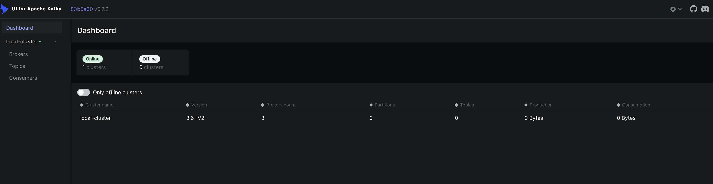

# Apache Kafka - Core Concepts

This repository contains a Docker Compose setup for a multi-broker Kafka cluster using KRaft mode. This README explains the core concepts of Apache Kafka to help you understand how the system works.

## What is Apache Kafka?

Apache Kafka is a distributed event streaming platform capable of handling trillions of events a day. Initially conceived as a messaging queue, Kafka is based on an abstraction of a distributed commit log. It's designed for high-throughput, fault-tolerance, and horizontal scalability.

## Core Kafka Concepts

### 1. Event/Message

An event (or message) is the basic unit of data in Kafka. It represents a fact or an occurrence and typically contains:
- A key (optional)
- A value (the actual data payload)
- A timestamp
- Optional metadata headers

Events are immutable - once published to Kafka, they cannot be changed.


### 2. Topics

Topics are the primary organizational unit in Kafka. They are similar to folders in a file system or tables in a database:

- Each topic has a name that uniquely identifies it within a cluster
- Topics store related events/messages
- Topics are partitioned and replicated across multiple brokers
- Topics are append-only, immutable logs of events
- Topics can be configured with retention policies (time-based or size-based)

### 3. Partitions

Each topic is divided into one or more partitions:

- Partitions allow for parallel processing and horizontal scaling
- Each partition is an ordered, immutable sequence of events
- Events within a partition are assigned a sequential ID called an offset
- Partitions are the unit of parallelism in Kafka
- Events with the same key are guaranteed to go to the same partition

```
Topic: orders
┌───────────────────┐  ┌───────────────────┐  ┌───────────────────┐
│   Partition 0     │  │   Partition 1     │  │   Partition 2     │
├───┬───┬───┬───┬───┤  ├───┬───┬───┬───┬───┤  ├───┬───┬───┬───┬───┤
│ 0 │ 1 │ 2 │ 3 │ 4 │  │ 0 │ 1 │ 2 │ 3 │ 4 │  │ 0 │ 1 │ 2 │ 3 │ 4 │
└───┴───┴───┴───┴───┘  └───┴───┴───┴───┴───┘  └───┴───┴───┴───┴───┘
    Offsets              Offsets              Offsets
```

#### Offsets (Sequential ID)
- A unique identifier assigned to each record(msg) in a partition.
- 讓kafka可以追踪訊息的順序
        - 尤其是需要追蹤consumer已處理的訊息位置
- 每一個partition裡的訊息都有一個offset，從0開始遞增+1


### 4. Brokers (kafka的核心)

Brokers are the **servers** that form a Kafka cluster:

- Each broker is identified by a unique ID
- Brokers store partitions of topics
- A single broker can handle thousands of partitions and millions of messages per second
- Brokers coordinate with each other using the controller (previously Zookeeper, now KRaft)
- Clients connect to any broker, which acts as a bootstrap to the entire cluster

### 5. Producers (訊息發送者)

Producers are applications that publish events to Kafka topics:

- Producers can choose which partition to send events to (by specifying a key or using a custom partitioner)
- Producers can operate in different acknowledgment modes:
  - `acks=0`: Fire and forget (no confirmation)
  - `acks=1`: Leader acknowledgment only
  - `acks=all`: Full acknowledgment from all in-sync replicas

### 6. Consumers (訊息接收者)

Consumers are applications that subscribe to topics and process the events:

- Consumers read events from partitions in order
- Consumers track their position in each partition using offsets
- Consumers operate in consumer groups for parallel processing
- Each partition is consumed by exactly one consumer in a consumer group

### 7. Consumer Groups (消費者群組)

Consumer groups allow for parallel processing of events:

- Each consumer in a group reads from exclusive partitions
- If there are more consumers than partitions, some consumers will be idle
- If there are fewer consumers than partitions, some consumers will read from multiple partitions
- Consumer groups enable horizontal scaling of event processing

```
Consumer Group: order-processing
┌───────────────┐  ┌───────────────┐  ┌───────────────┐
│  Consumer 1   │  │  Consumer 2   │  │  Consumer 3   │
└───────┬───────┘  └───────┬───────┘  └───────┬───────┘
        │                  │                  │
        ▼                  ▼                  ▼
┌───────────────┐  ┌───────────────┐  ┌───────────────┐
│ Partition 0   │  │ Partition 1   │  │ Partition 2   │
└───────────────┘  └───────────────┘  └───────────────┘
        Topic: orders
```

### 8. Replication (複製數)

Kafka provides fault tolerance through replication:

- Each partition can have multiple replicas spread across brokers
- One replica is designated as the leader, handling all reads and writes
- Other replicas are followers, continuously replicating data from the leader
- If a leader fails, one of the followers becomes the new leader
- The replication factor determines how many copies of data exist

### 9. KRaft (Kafka Raft)

KRaft is Kafka's new consensus protocol that replaces Zookeeper:

- Introduced in Kafka 2.8 as a preview feature and production-ready in 3.3
- Uses the Raft consensus algorithm for metadata management
- Simplifies Kafka's architecture by removing the Zookeeper dependency
- Improves scalability by supporting more partitions per cluster
- Provides better security with a unified security model

Kraft mode的每一個kafka server都是可以被configure成controller或者broker的，又或者同時兼任。
- process.roles: controller, broker / broker, controller

一般來說，同時兼任的話就會被稱為 ‘combined servers’，但是combined mode真的是不被推薦的。因為同時兼任會增加未來scaling的困難度。

#### Controller

Kraft mode的controller node是負責管理metadata和leader elections的。
所以基本上，controller mode is either active or hot standby.
一般來說，會配置3-5個controller node，這樣可以確保在一個controller node故障時，其他controller node可以接管。

### Broker

Kraft mode的broker node = server in the Kafka storage layer
負責store 從單個或多個event streams傳進來的訊息

*！！！ 只要連結上一個kafka broker node，就可以連結上所有brokers in the cluster。*

In our Docker Compose setup:
- We have a dedicated controller node and broker nodes with controller capabilities
- The controller quorum manages metadata and leader elections
- The cluster uses a unique cluster ID for identification


### 10. Retention and Compaction 

Kafka provides two ways to manage data lifecycle:

- **Retention**: Keep messages for a specified time or until a size limit is reached
- **Compaction**: Keep at least the latest message for each key (useful for change data capture)

## Advanced Concepts

### 1. Exactly-Once Semantics (確保訊息只被處理一次)

Kafka provides different delivery guarantees:

- **At-most-once**: Messages may be lost but never redelivered
- **At-least-once**: Messages are never lost but may be redelivered
- **Exactly-once**: Messages are delivered once and only once (using transactions)

### 2. Stream Processing 

Kafka Streams is a client library for building applications that process and analyze data in Kafka:

- Stateless operations: filter, map, flatMap
- Stateful operations: aggregations, joins, windowing
- Enables real-time data processing without external systems

### 3. Connect API

Kafka Connect is a framework for connecting Kafka with external systems:

- Source connectors import data from external systems into Kafka
- Sink connectors export data from Kafka to external systems
- Connectors handle scalability, fault tolerance, and offset management

Connect API 主要是成為kafka與外部系統的連結橋樑。

```json
{
        "name": "mongodb-sink",
        "config": {
            "connector.class": "com.mongodb.kafka.connect.MongoSinkConnector",
            "tasks.max": "1",
            "topics": "my-topic",
            "connection.uri": "mongodb://localhost:27017",
            "database": "mydatabase",
            "collection": "mycollection"
        }
}
```

### 4. Schema Registry

The Schema Registry stores and manages schemas for Kafka messages:

- Supports schema evolution with compatibility checks
- Common formats include Avro, Protobuf, and JSON Schema
- Enables data governance and prevents breaking changes

## Our Kafka Cluster Architecture

Our Docker Compose setup implements a robust Kafka cluster with:

1. **Dedicated Controller Node**: Manages cluster metadata and leader elections
2. **Multiple Broker Nodes**: Store and serve data with replication
3. **KRaft Mode**: Modern consensus protocol without Zookeeper dependency
4. **High Availability**: Replication factor of 3 for fault tolerance
5. **Kafka UI**: Web interface for monitoring and management

## Working with Kafka

### Basic Commands

Create a topic:
```bash
kafka-topics.sh --bootstrap-server localhost:9092 --create --topic my-topic --partitions 3 --replication-factor 3
```

List topics:
```bash
kafka-topics.sh --bootstrap-server localhost:9092 --list
```

Produce messages:
```bash
kafka-console-producer.sh --bootstrap-server localhost:9092 --topic my-topic
```

Consume messages:
```bash
kafka-console-consumer.sh --bootstrap-server localhost:9092 --topic my-topic --from-beginning
```

Describe a topic:
```bash
kafka-topics.sh --bootstrap-server localhost:9092 --describe --topic my-topic
```

## References

- [Apache Kafka Documentation](https://kafka.apache.org/documentation/)
- [Confluent Kafka Documentation](https://docs.confluent.io/platform/current/kafka/introduction.html)
- [KRaft Mode Documentation](https://kafka.apache.org/documentation/#kraft)


# Apache Kafka UI

