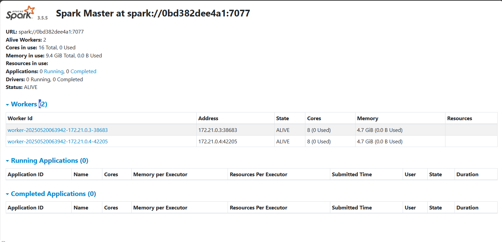

# Apache Spark

Apache Spark is an open-source, distributed processing system used for big data workloads.

Sparks can works on single-node machine, and clustered machines to perform data engineering, data science, and also machine learning.

## How Apache Spark works?

Spark's can be used to address the limitations of MapReduce. 

- 

## What Apache Spark can do?

- Batch/ Stream Processing
- SQL analytics
- Data science (Scaable)
- Machine learning

## MapReduce

Reference: https://www.ibm.com/cn-zh/topics/mapreduce

MapReduce 
- is a programming model which is well-known for its big data processing ability.
- has a parallel and distributed algorithm supports the needs for processing the big data.
- helps chunk data processing projects into smaller pieces so they can run faster

This is the Spark UI which can monitor the Spark's condition.

