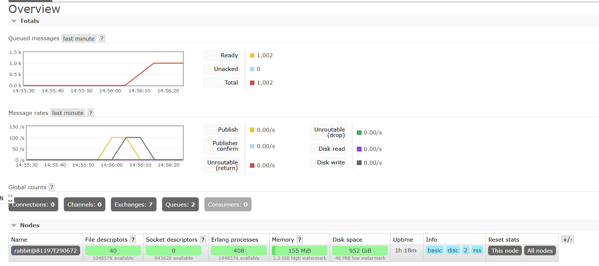
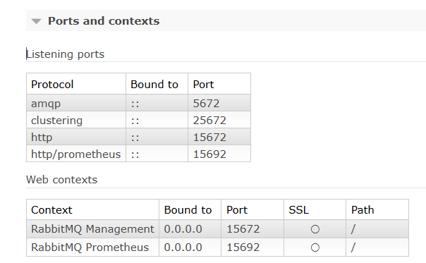
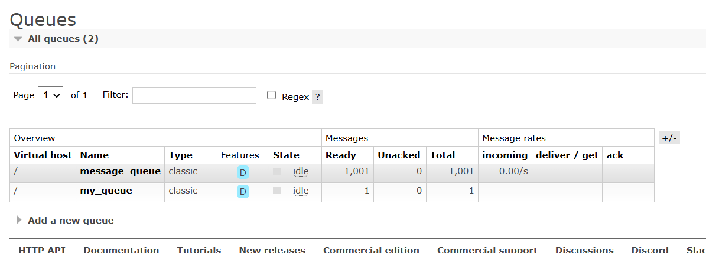

# Rabbit Message Queue

## What is RabbitMQ?
It is a message broker which allow the applications to exchange message between each other.

### RabbitMQ Concept
RabbitMQ will accepts message from publishers, route the messages to specific queue. RabbitMQ can
- store the messages for later consumptions, or
- deliver the message directly to the consumer

### RabbitMQ features
1. AMQP (Advanced Message Queuing Protocol)
* This is an open standard application layer protocol
* Designed for message-oriented middleware
* Enables system and applications to communicate   

### Overview in RabbitMQ

While the message getting in, the RabbitMQ provided their own metrics about the messages in queue and the incoming rates.

#### Nodes in the Overview panel
This is important for monitoring the MQ nodes healthy status.
#### Ports and context in Overview

### Queues in RabbitMQ

From the Image above, there are two queues in the RabbitMQ.
- my_queue
- message_queue

Reference: https://www.rabbitmq.com/docs/use-rabbitmq
Reference: https://medium.com/cwan-engineering/rabbitmq-concepts-and-best-practices-aa3c699d6f08
